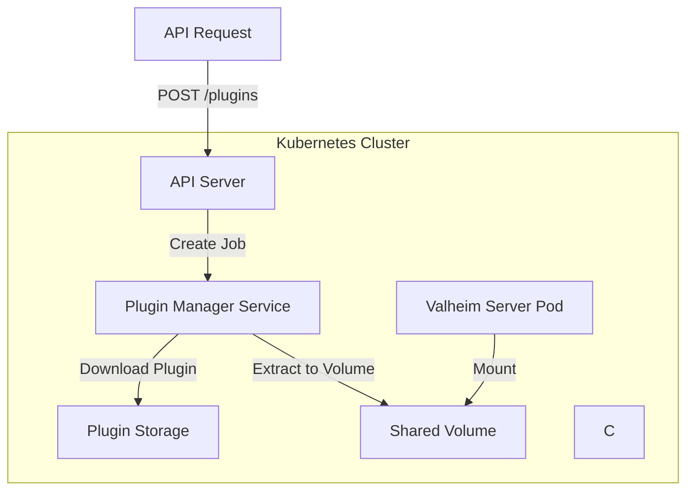

# HearthHub Mod API
An API running on the dedicated linux machine for interfacing with the Valheim server. This repository
contains a docker image which runs the Valheim server. Unlike the docker image that comes pre-packaged with the Valheim
dedicated server this image installs the server directly onto the image rather than running a separate 
script in a generic ubuntu image.

This means that the dedicated server arguments (i.e world name, password, crossplay etc...) can be modified when the image is deployed or run.

## Architecture

The diagram below represents the general architecture for this repository.

## Building

To build the docker image run: `docker build . -t cbartram/hearthhub:0.0.1` replacing `0.0.1` with
the image version you would like to use. 

Push to the defined registry with: `docker push cbartram/hearthhub:0.0.1`

## Running

You can run the Valheim dedicated server with `./start_server_docker.sh`

## Deployment

Deployment is managed through Helm. To deploy the dedicated server run:

`helm install valheim-server ./manifests/valheim-server -f ./manifests/valheim-server/values.yaml`

You can override specific configuration like game world name, server name, and password with the helm `--set` command.

To deploy the hearthhub-mod-api run:

`helm install hearthhub-mod-api ./manifests/hearthhub-mod-api -f ./manifests/hearthhub-mod-api/values.yaml`

## Built With

- [Kubernetes](https://kubernetes.io) - Container orchestration platform
- [Helm](https://helm.sh) - Manages Kubernetes deployments
- [Docker](https://docker.io/) - Container build tool
- [Stean](https://steam.com) - CLI used to install Valheim dedicated server

## Contributing

Please read [CONTRIBUTING.md](CONTRIBUTING.md) for details on our code
of conduct, and the process for submitting pull requests to us.

## Versioning

We use [Semantic Versioning](http://semver.org/) for versioning. For the versions
available, see the [tags on this
repository](https://github.com/cbartran/hearthhub-mod-api/tags).

## Authors

- **cbartram** - *Initial work* -
  [cbartram](https://github.com/cbartram)

## License

This project is licensed under the [CC0 1.0 Universal](LICENSE)
Creative Commons License - see the [LICENSE.md](LICENSE) file for
details
