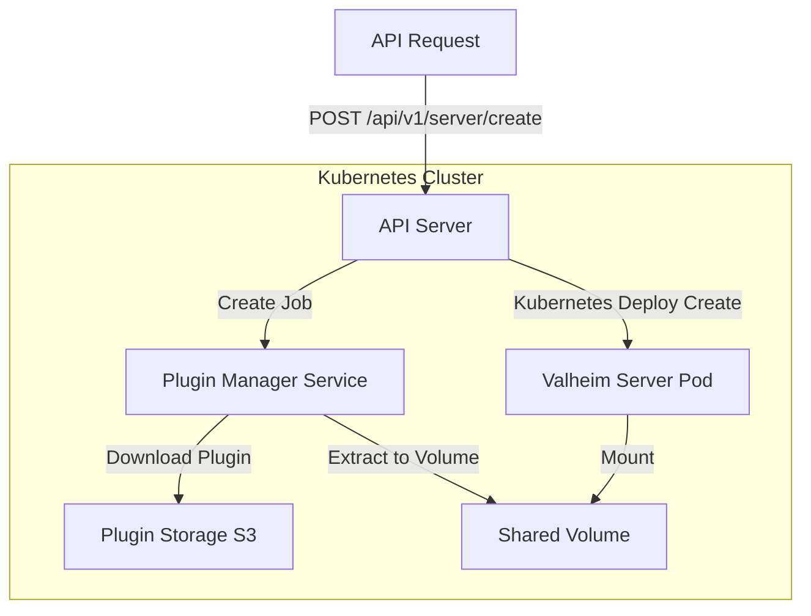
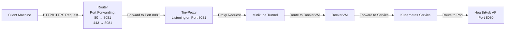

<p align="center">
   
</p>

[![Contributors][contributors-shield]][contributors-url]
[![Forks][forks-shield]][forks-url]
[![Stargazers][stars-shield]][stars-url]
[![Issues][issues-shield]][issues-url]
[![MIT License][license-shield]][license-url]

# HearthHub Kube API

An API running on the dedicated linux machine for interfacing between the internet and Kubernetes. This repository
contains a docker image which runs the Valheim server on Kubernetes. Unlike the docker image that comes pre-packaged with the Valheim
dedicated server this image installs the server directly onto the image rather than running a separate 
script in a generic ubuntu image. It also pre-installs BepInEx on the server, sets up a PVC, and has routes to configure:

- Mod installation
- Mod removal
- Automated world backups (to s3)
- Configuration installation for mods
- Existing World uploads

all directly on the Valheim Dedicated Server!

## Architecture

The diagram below represents the general architecture for this repository.



## Building

To build the docker image  for the Valheim server run: `./scripts/build_server.sh 0.0.1` replacing `0.0.1` with
the image version you would like to use. You should then update the version in the `./manifests/valheim-server/values.yaml`
file to match your built image.

Run the `./scripts/build_api.sh` to do the same for the API image.

## Testing

Run unit tests for this software with:

```shell
go test ./... -v
```

To generate coverage reports run:

```shell
go test -coverprofile=coverage.out ./...
go tool cover -html=coverage.out
```

## Kubernetes Setup 

### K3s

[K3's](https://docs.k3s.io) is the preferred deployment option because:
- You can skip the entire [Networking](#networking-minikube-only) section and omit the `tinyproxy` server since it runs natively on the host
- You can add additional nodes to the cluster to scale horizontally
- Does not require any type of additional tunneling to be present i.e. `minikube tunnel` in order to access from the internet

To setup K3's install via: `curl -sfL https://get.k3s.io | sh -`

Then create a `/etc/rancher/k3s/config.yaml` with the following contents:

```yaml
kubelet-arg:
  - --system-reserved=cpu=2000m,memory=8000Mi,ephemeral-storage=256Gi
  - --eviction-hard=imagefs.available<10%,imagefs.inodesFree<10%,memory.available<1Gi,nodefs.available<10%,nodefs.inodesFree<10%,pid.available<10%
  - --max-pods=100
```

This ensures K3's uses at most 2 CPU core's and 8GB of memory to run leaving some resources for your host system. This is necessary since the
cluster does not run in a VM and shares the host network space.

Finally run: `./scripts/cluster_init.sh` to initialize the required ingress and load balancer controllers, namespaces, and secrets. See [Deploying
the API](#deploying-valheim-server-and-hearthhub-api) for more information on how to deploy.

### MiniKube (Deprecated)

:warning: We do not recommend using MiniKube because of networking issues exposing the API to the internet. See [k3s instead](#k3s).

Deployment can be managed through Helm and Minikube. Follow the [MiniKube setup guide](https://minikube.sigs.k8s.io/docs/start/) to the point where you have your cluster running.
Install [Helm](https://helm.sh) using their [installation script](https://helm.sh/docs/intro/install/).

Create the `hearthhub` namespace on your cluster with: `kubectl create ns hearthhub`. It's also useful to have the 
`Ingress` addon with MiniKube configured. You can configure this with `minikube addons enable ingress`.

Since the API makes updates to custom AWS Cognito user attributes, make sure to enter the AWS Cognito related secrets for running the API:

```shell
# Cognito Secrets
 kubectl create secret generic cognito-secrets \
   --from-literal=USER_POOL_ID=us-east-1_example \
   --from-literal=COGNITO_CLIENT_ID=abc123example \
   --from-literal=COGNITO_CLIENT_SECRET=supersecretvalue \
   -n hearthhub

# AWS Secrets
 kubectl create secret generic aws-creds \
 --from-literal=AWS_ACCESS_KEY_ID=<KEY> \
 --from-literal=AWS_SECRET_ACCESS_KEY=<SECRET> \
 -n hearthhub
```

Finally, you should update your `/etc/hosts/` file with the DNS entry for your API:

```shell
# Add this to /etc/hosts
127.0.0.1 hearthhub-api.example
```

:warning: For internet access to the API you will also need to deploy a `tinyproxy` or proxy service on a port of your choosing running on the host to proxy
requests from the internet to the VM while the tunnel is running. See [networking](#networking-minikube-only) for more information.

### Deploying Valheim Server and HearthHub API
To deploy the hearthhub-KUBE-api run:

`helm install hearthhub-kube-api ./manifests/hearthhub-kube-api -f ./manifests/hearthhub-kube-api/values.yaml`

The API comes with a service which exposes `NodePort` 30000 and can be accessed via: `http://localhost:30000/api/v1/health`
The API is pre-configured with basic auth, and you can generate the auth value like so:

```shell
AUTH_VALUE=$(echo <discord_id>:<refresh_token> | base64)

curl -H "Authorization: Basic $AUTH_VALUE" -X GET http://localhost:30000/api/v1/health
```

### API Routes

Coming soon.

### Running Locally

You can run this API locally but will need to create a `.env` file in the root of the project.

```dotenv
COGNITO_CLIENT_SECRET=<cognito_secret>
COGNITO_CLIENT_ID=<cognito_client_id>
USER_POOL_ID=<user_pool_id>

AWS_SECRET_ACCESS_KEY=<aws_secret_access_key>
AWS_ACCESS_KEY_ID=<aws_access_key_id>
AWS_REGION=us-east-1

CPU_REQUEST=1
CPU_LIMIT=1
MEMORY_REQUEST=4Gi
MEMORY_LIMIT=4Gi
BUCKET_NAME=<your-s3-bucket-no-s3://-prefix>

VALHEIM_IMAGE_NAME=cbartram/hearthhub
VALHEIM_IMAGE_VERSION=0.0.6
BACKUP_MANAGER_IMAGE_NAME=cbartram/hearthhub-sidecar
BACKUP_MANAGER_IMAGE_VERSION=0.0.4
FILE_MANAGER_IMAGE_NAME=cbartram/hearthhub-plugin-manager
FILE_MANAGER_IMAGE_VERSION=0.0.9

RABBITMQ_DEFAULT_USER=<username>
RABBITMQ_DEFAULT_PASS=<pass>
```

Build the API with `go build -o main .` and run with `./main` The API will be running on: `http://localhost:8080`

## Networking (MiniKube only)

:warning: This application has been built and tested on [MiniKube](https://minikube.sigs.k8s.io) however, we strongly recommend using [K3s](https://k3s.io/)

Minikube uses (by default) a Docker VM to run MiniKube which has its own network separate
from your host machine. By running `minikube tunnel` it will forward services from your [MiniKube](https://minikube.sigs.k8s.io) network to your host network and **ONLY**
your host network.

What this means is that if you have a service like this:

```shell
NAME                TYPE           CLUSTER-IP      EXTERNAL-IP   PORT(S)          AGE
hearthhub-kube-api   LoadBalancer   10.99.134.178   127.0.0.1     8080:30616/TCP   9m41s
```

Then:

`curl http://localhost:8080/api/v1/health` will resolve. However, port forwarding your router and going to: `http://<your-ip>:8080/api/v1/health` will
not resolve. It is only available on your host machine. Great for testing, not great for exposing your service to the internet. You can further verify this
by opening up and forwarding port `8081` on your router and starting a Python http server.

`python3 -m http.server 8081`

Going to [CanYouSeeMe.org](https://canyouseeme.org/) for port `8081` will show successful while port `8080` will show nothing even though both are port forwarded
and HTTP server's are running on both ports.

The solution: [Tinyproxy](https://tinyproxy.github.io/)

Install tinyproxy with `sudo apt install tinyproxy`

Apply the following configurations to `/etc/tinyproxy/tinyproxy.conf`

- `Port 8081`
- Comment out all "Allow" statements (effectively allow all)
- `Upstream http 127.0.0.1:8080` (assumes hearthhub-api service's external IP is 127.0.0.1 and its port is 8080)

Now tiny proxy is setup on the host machine to proxy traffic from all external sources to the `minikube tunnel` which is forwarding
the Hearthhub Mod API service.



### TLDR

```shell
minikube start --cpus 3 --memory 8192

# In a new window (necessary to expose services in the cluster VM to your host)
# so the proxy can reach your API.
minikube tunnel

sudo systemctl start tinyproxy

# Test tinyproxy -> minikube -> service -> pod
curl http://127.0.0.1:8081/api/v1/health
```

## Built With

- [Kubernetes](https://kubernetes.io) - Container orchestration platform
- [Helm](https://helm.sh) - Manages Kubernetes deployments
- [Docker](https://docker.io/) - Container build tool
- [Steam](https://steam.com) - CLI used to install Valheim dedicated server

## Contributing

Please read [CONTRIBUTING.md](CONTRIBUTING.md) for details on our code
of conduct, and the process for submitting pull requests to us.

## Versioning

We use [Semantic Versioning](http://semver.org/) for versioning. For the versions
available, see the [tags on this
repository](https://github.com/cbartran/hearthhub-mod-api/tags).

## Authors

- **cbartram** - *Initial work* - [cbartram](https://github.com/cbartram)

## License

This project is licensed under the [CC0 1.0 Universal](LICENSE)
Creative Commons License - see the [LICENSE.md](LICENSE) file for
details

[contributors-shield]: https://img.shields.io/github/contributors/cbartram/hearthhub-kube-api.svg?style=for-the-badge
[contributors-url]: https://github.com/cbartram/hearthhub-kube-api/graphs/contributors
[forks-shield]: https://img.shields.io/github/forks/cbartram/hearthhub-kube-api.svg?style=for-the-badge
[forks-url]: https://github.com/cbartram/hearthhub-kube-api/network/members
[stars-shield]: https://img.shields.io/github/stars/cbartram/hearthhub-kube-api.svg?style=for-the-badge
[stars-url]: https://github.com/cbartram/hearthhub-kube-api/stargazers
[issues-shield]: https://img.shields.io/github/issues/cbartram/hearthhub-kube-api.svg?style=for-the-badge
[issues-url]: https://github.com/cbartram/hearthhub-kube-api/issues
[license-shield]: https://img.shields.io/github/license/cbartram/hearthhub-kube-api.svg?style=for-the-badge
[license-url]: https://github.com/cbartram/hearthhub-kube-api/blob/master/LICENSE
