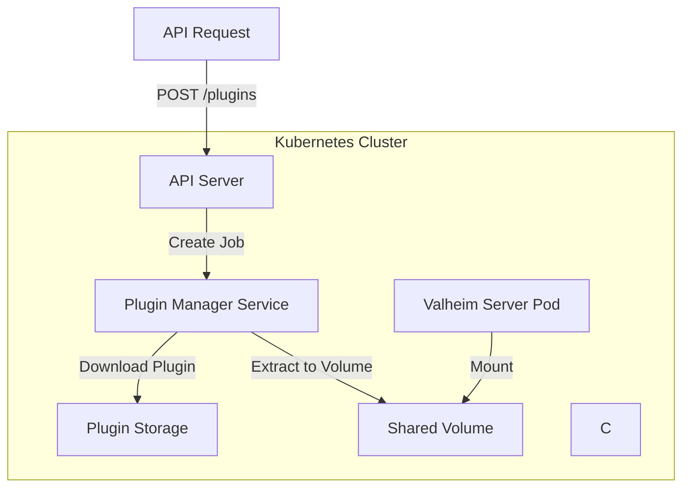
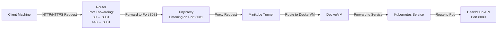

# HearthHub Mod API

An API running on the dedicated linux machine for interfacing with the Valheim server. This repository
contains a docker image which runs the Valheim server. Unlike the docker image that comes pre-packaged with the Valheim
dedicated server this image installs the server directly onto the image rather than running a separate 
script in a generic ubuntu image. It also pre-packages BepInEx and configures it for use within the server

This means that the dedicated server arguments (i.e world name, password, crossplay etc...) can be modified when the image is deployed or run.

## Architecture

The diagram below represents the general architecture for this repository.



## Building

To build the docker image  for the Valheim server run: `./scripts/build_server.sh 0.0.1` replacing `0.0.1` with
the image version you would like to use. You should then update the version in the `./manifests/valheim-server/values.yaml`
file to match your built image.

Run the `./scripts/build_api.sh` to do the same for the API image.

## Networking

This application was built and tested on [MiniKube](https://minikube.sigs.k8s.io). Minikube uses (usually) a Docker VM to run MiniKube which has its own network separate
from your host machine. By running `minikube tunnel` it will forward services from your [MiniKube](https://minikube.sigs.k8s.io) network to your host network and **ONLY** 
your host network.

What this means is that if you have a service like this:

```shell
NAME                TYPE           CLUSTER-IP      EXTERNAL-IP   PORT(S)          AGE
hearthhub-mod-api   LoadBalancer   10.99.134.178   127.0.0.1     8080:30616/TCP   9m41s
```

Then:

`curl http://localhost:8080/api/v1/health` will resolve. However, port forwarding your router and going to: `http://<your-ip>:8080/api/v1/health` will
not resolve. It is only available on your host machine. Great for testing, not great for exposing your service to the internet. You can further verify this
by opening up and forwarding port `8081` on your router and starting a Python http server.

`python3 -m http.server 8081`

Going to [CanYouSeeMe.org](https://canyouseeme.org/) for port `8081` will show successful while port `8080` will show nothing even though both are port forwarded
and HTTP server's are running on both ports.

The solution: [Tinyproxy](https://tinyproxy.github.io/)

Install tinyproxy with `sudo apt install tinyproxy`

Apply the following configurations to `/etc/tinyproxy/tinyproxy.conf`

- `Port 8081`
- Comment out all "Allow" statements (effectively allow all)
- `Upstream http 127.0.0.1:8080` (assumes hearthhub-api service's external IP is 127.0.0.1 and its port is 8080)

Now tiny proxy is setup on the host machine to proxy traffic from all external sources to the `minikube tunnel` which is forwarding
the Hearthhub Mod API service.



## Deployment

### Kubernetes Setup 
Deployment is managed through Helm and Minikube. Follow the [MiniKube setup guide](https://minikube.sigs.k8s.io/docs/start/) to the point where you have your cluster running.
Install [Helm](https://helm.sh) using their [installation script](https://helm.sh/docs/intro/install/).

Create the `hearthhub` namespace on your cluster with: `kubectl create ns hearthhub`. It's also useful to have the 
`Ingress` addon with MiniKube configured. You can configure this with `minikube addons enable ingress`.

Since the API makes updates to custom AWS Cognito user attributes, make sure to enter the AWS Cognito related secrets for running the API:

```shell
# Cognito Secrets
 kubectl create secret generic cognito-secrets \
   --from-literal=USER_POOL_ID=us-east-1_example \
   --from-literal=COGNITO_CLIENT_ID=abc123example \
   --from-literal=COGNITO_CLIENT_SECRET=supersecretvalue \
   -n hearthhub

# AWS Secrets
 kubectl create secret generic aws-creds \
 --from-literal=AWS_ACCESS_KEY_ID=<KEY> \
 --from-literal=AWS_SECRET_ACCESS_KEY=<SECRET> \
 -n hearthhub
```

Finally, you should update your `/etc/hosts/` file with the DNS entry for your API:

```shell
# Add this to /etc/hosts
127.0.0.1 hearthhub-api.example
```

### Deploying Valheim and HearthHub API
To deploy the dedicated server run:

`helm install valheim-server ./manifests/valheim-server -f ./manifests/valheim-server/values.yaml`

You can override specific configuration like game world name, server name, and password with the helm `--set` command.

To deploy the hearthhub-mod-api run:

`helm install hearthhub-mod-api ./manifests/hearthhub-mod-api -f ./manifests/hearthhub-mod-api/values.yaml`

## Running

Before you can actually make requests to the API you need to run `minikube tunnel` in a separate terminal window and **keep it open**.
This ensures that requests can be correctly proxied to the cluster from the local machine.

Check the API is running with: `curl http://hearthhub-api.example/api/v1/health` You should see: `{"status": "OK"}`


### Running Locally

You can run this API locally but will need to create a `.env` file in the root of the project. The `.env` file should
have the following env vars set:

```shell
# CPU & Mem requests and limits for the dedicated server that will be created
CPU_REQUEST=1
CPU_LIMIT=1
MEMORY_REQUEST=4Gi
MEMORY_LIMIT=4Gi

# Valheim image conf
VALHEIM_IMAGE_NAME=<YOUR VALHEIM SERVER IMAGE built from Dockerfile in this repo>
VALHEIM_IMAGE_VERSION=<YOUR VALHEIM Server image version i.e. 0.0.1>

# Cognito Conf
COGNITO_CLIENT_ID=<YOUR_COGNITO_CLIENT_ID>
COGNITO_CLIENT_SECRET=<YOUR_COGNITO_SECRET>
USER_POOL_ID=<YOUR_USER_POOL_ID>

# AWS SDK conf
AWS_SECRET_ACCESS_KEY=<YOUR_AWS_SECRET_KEY>
AWS_ACCESS_KEY_ID=<YOUR_AWS_ACCESS_KEY>
AWS_REGION=us-east-1
```

Build the API with `go build -o main .` and run with `./main` The API will be running on: `http://localhost:8080`

## Built With

- [Kubernetes](https://kubernetes.io) - Container orchestration platform
- [Helm](https://helm.sh) - Manages Kubernetes deployments
- [Docker](https://docker.io/) - Container build tool
- [Steam](https://steam.com) - CLI used to install Valheim dedicated server

## Contributing

Please read [CONTRIBUTING.md](CONTRIBUTING.md) for details on our code
of conduct, and the process for submitting pull requests to us.

## Versioning

We use [Semantic Versioning](http://semver.org/) for versioning. For the versions
available, see the [tags on this
repository](https://github.com/cbartran/hearthhub-mod-api/tags).

## Authors

- **cbartram** - *Initial work* -
  [cbartram](https://github.com/cbartram)

## License

This project is licensed under the [CC0 1.0 Universal](LICENSE)
Creative Commons License - see the [LICENSE.md](LICENSE) file for
details
